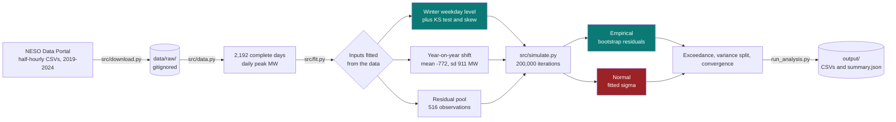

<div align="center">

# Peak Demand Monte Carlo

### Forecasting next winter's peak GB electricity demand, with every input fitted from measured data instead of assumed

[](https://github.com/jumma786/water-demand-monte-carlo/actions/workflows/tests.yml)
[](#test-coverage)
[](tests/test_simulate.py)
[](#environment-matrix)
[](https://www.neso.energy/data-portal/historic-demand-data)
[](https://docs.astral.sh/ruff/)

**Real data. Real tests. A result that argues against the obvious modelling choice.**

</div>

---

> [!IMPORTANT]
> **The headline finding is about method, not megawatts.** Reaching for a normal
> distribution out of habit **overstates the upper tail risk by a factor of four**
> on this data. The one-line test that catches it is asserted in the suite, so the
> finding cannot quietly rot if the data is refreshed.

## Highlights

| | What it does | Why it matters |
|---|---|---|
| **Every input measured** | Level, trend and spread are all fitted from six years of NESO half-hourly data | No hand-tuned constants, so a reader can audit the fit instead of trusting it |
| **Normality tested, not assumed** | KS test `p = 0.0145`, de-trended skew `-0.687` | The distribution is left-skewed, so a fitted normal is the wrong default |
| **Two variants side by side** | Bootstrapped residuals vs a fitted normal, same 200,000 iterations | Isolates exactly what the convenient assumption costs you |
| **Tail error quantified** | Normal overstates `P(peak > 46 GW)` by **12x** | The error grows the deeper into the tail you look, which is where capacity decisions live |
| **Variance attributed** | Day-to-day **89.6%** vs year-on-year **10.2%** | Says where more modelling effort actually pays, and where it does not |
| **Convergence checked** | P99 still moves 134 MW at 5,000 iterations | A Monte Carlo number quoted without this is of unknown precision |
| **Partial days dropped, not averaged** | Days outside 46 to 50 settlement periods excluded | A partially captured day looks like a demand dip that never happened |
| **Verified in CI** | 15 tests, 84% coverage, Python 3.11 and 3.12 | Every figure on this page is reproducible from a clean checkout |

## Architecture



The structural judgement, and the only one in the model, is the top line of `simulate.py`:

> `peak = last winter's level + a year-on-year shift + day-to-day variation`

Everything feeding that line is measured.

## Quickstart

```bash
git clone https://github.com/jumma786/water-demand-monte-carlo.git
cd water-demand-monte-carlo

python -m venv .venv && source .venv/bin/activate
pip install -r requirements.txt

python -m src.download      # fetch the NESO CSVs (~9 MB, not committed)
python run_analysis.py      # full analysis, writes output/
pytest -q                   # 15 tests
```

On Windows the activate step is `.venv\Scripts\activate`.

> [!NOTE]
> The source CSVs are **not committed**. They are openly licensed, but they are
> data rather than code, and a git history is the wrong place for 9 MB of them.
> The download step is idempotent, and CI caches the result between runs.

> [!TIP]
> The download endpoint **302-redirects**. `urllib` follows redirects by default,
> but if you fetch these by hand, `curl` needs `-L` or you will silently save a
> 1.3 KB HTML page under a `.csv` name. `src/download.py` now rejects any response
> too small to be a real file instead of letting the parser guess at it.

## Environment matrix

| Requirement | Version | Notes |
|---|---|---|
| Python | **3.11 / 3.12** | Both verified in CI on every push |
| `numpy` | `>=1.24` | `default_rng` for seeded, reproducible draws |
| `pandas` | `>=2.0` | `format="mixed"` date parsing needs 2.x |
| `scipy` | `>=1.10` | KS test and Welch t-test |
| `pytest` | `>=7.0` | The `pythonpath` ini option requires 7.0+ |
| `pytest-cov` | `>=4.0` | Coverage reporting |
| Disk | ~10 MB | Source CSVs under `data/raw/` |
| Network | Once | Only for `src.download`; everything after that is offline |

No API key, no account, no credentials. The data portal is open.

## Usage showcase

**Run one variant and read the percentiles.**

```python
from src.data import load_daily_peaks
from src.simulate import simulate, summarise, exceedance

daily = load_daily_peaks()
sim = simulate(daily, n_sims=200_000, seed=42, variation="empirical")

summarise(sim)
# {'n_iterations': 200000, 'p50': 38843.0, 'p90': 42135.0, 'p99': 44275.0, ...}

exceedance(sim, 45_000)      # 0.0030
```

**Reproduce the headline finding in three lines.**

```python
normal = simulate(daily, variation="normal", seed=42)

exceedance(sim,    46_000)   # 0.0004  <- bootstrapped from actual residuals
exceedance(normal, 46_000)   # 0.0048  <- fitted normal, 12x higher
```

**Check the assumption before you rely on it.**

```python
from src.fit import fit_winter_weekday_peaks

f = fit_winter_weekday_peaks(daily)
f["detrended_skew"]         # -0.687
f["ks_pvalue_vs_normal"]    #  0.0145   <- normality rejected at 5%
```

### What the data says before any simulation runs

| Year | Mean winter weekday peak (MW) | SD | n |
|---|---|---|---|
| 2019 | 43,278 | 2,555 | 86 |
| 2020 | 42,043 | 1,891 | 87 |
| 2021 | 42,172 | 2,585 | 86 |
| 2022 | 40,286 | 3,407 | 85 |
| 2023 | 39,212 | 2,847 | 85 |
| 2024 | 39,420 | 2,813 | 87 |

Year-on-year change averages **-772 MW** with a standard deviation of **911 MW**
across five transitions, so the decline is real but noisy. Two of the five years
went up. Weekday peaks exceed weekend peaks by **3,172 MW** (Welch t-test,
`p = 1.15e-29`).

The population of interest is **winter weekday peaks** (Nov to Feb, Mon to Fri),
which is when the system is stressed and therefore what a capacity question is
about. That gives 516 observations.

### The finding

Two variants of the same simulation, 200,000 iterations each, identical
year-on-year term. They differ only in how day-to-day variation is drawn.

| Percentile | Empirical bootstrap | Fitted normal |
|---|---|---|
| P50 | 38,843 MW | 38,656 MW |
| P90 | 42,135 MW | 42,304 MW |
| **P99** | **44,275 MW** | **45,265 MW** |

| Exceedance | Empirical | Normal | Overstatement |
|---|---|---|---|
| `P(peak > 44,000 MW)` | 1.47% | 3.00% | **2.0x** |
| `P(peak > 45,000 MW)` | 0.30% | 1.30% | **4.3x** |
| `P(peak > 46,000 MW)` | 0.04% | 0.48% | **12x** |

Because the real distribution is left-skewed, a normal puts far too much mass in
the upper tail. An analyst who fits a normal without testing it will plan for a
peak roughly four times less likely than their model claims, and the error grows
the further into the tail you look.

### Where the uncertainty comes from

| Component | Share of variance |
|---|---|
| Day-to-day variation | **89.6%** |
| Year-on-year shift | 10.2% |

Nine tenths of the spread is weather and behaviour on the day, not the trend.
Refining the trend estimate is close to worthless for this question. The payoff
is in modelling daily variation better.

### Convergence

| Iterations | P50 | P99 | P99 shift vs previous |
|---|---|---|---|
| 1,000 | 38,827 | 44,006 | |
| 5,000 | 38,780 | 44,140 | 134 |
| 25,000 | 38,839 | 44,274 | 134 |
| 100,000 | 38,821 | 44,207 | 68 |
| 200,000 | 38,843 | 44,275 | 68 |
| 500,000 | 38,823 | 44,241 | 34 |

Tail percentiles converge far more slowly than the median. At 1,000 iterations
the P99 still moves by over 130 MW between sizes, which is enough to change a
margin decision.

## Developer workflow

```bash
pytest -q                                     # 15 tests
pytest -q --cov=src --cov-report=term-missing
ruff check src tests                          # pinned to 0.16.6, same as CI
```

### Continuous integration


Defined in [`.github/workflows/tests.yml`](.github/workflows/tests.yml). Two of
those choices were made the hard way:

- **`ruff` is pinned to an exact version.** The first CI run went red on import
  ordering alone, because the runner installed a newer ruff than the local one. A
  linter that floats can fail a build on a day nobody touched the code.
- **`pythonpath = .` lives in `pytest.ini`, not in the workflow.** CI ran a bare
  `pytest` and could not import `src/`, since only the `python -m` form puts the
  working directory on `sys.path`. Fixing it in config means a contributor
  cloning this gets the working path too.

### Test coverage

| Module | Coverage | |
|---|---|---|
| `src/fit.py` | **100%** | Every fitted input is exercised |
| `src/simulate.py` | **100%** | Both variants, plus convergence and variance split |
| `src/data.py` | **96%** | Loader and the partial-day filter |
| `src/download.py` | **0%** | Network fetch, deliberately not exercised in the suite |
| **TOTAL** | **84%** | Measured in CI on 3.11 and 3.12 |

The 15 tests cover data span and completeness, physical plausibility, the
winter-exceeds-summer and weekday-exceeds-weekend sanity checks, residual
centring, **the non-normality finding**, seed reproducibility, percentile
ordering, **the normal-overstates-the-tail result**, exceedance monotonicity,
variance shares, and convergence tightening.

## Honesty

> [!IMPORTANT]
> The data is real and openly licensed. **The megawatt figures are a method
> demonstration, not an operational forecast.**

The simulation structure is a deliberate simplification. It carries:

- **No weather covariate.** The NESO demand file has no temperature column, and
  temperature is the largest known omitted driver of electricity demand.
- **No explicit COVID adjustment** for 2020, which is left in the sample untouched.
- **No embedded-generation treatment**, which shifts what "demand" even means over
  a six-year window.

A production forecast would need all three. What transfers is the method: fitting
inputs from data instead of assuming them, testing the distributional assumption
before relying on it, separating where the uncertainty actually comes from, and
checking convergence at the percentile you intend to quote.

## Layout

```
src/data.py         load NESO half-hourly, aggregate to daily peaks
src/fit.py          estimate every input from the data, with fit diagnostics
src/simulate.py     simulation, summary, exceedance, convergence, variance split
src/download.py     fetch the source CSVs, reject non-CSV responses
run_analysis.py     runs everything, writes output/
tests/              15 tests
pytest.ini          pythonpath, so a bare `pytest` works
.github/workflows/  CI on 3.11 and 3.12
```

## Roadmap

| | Item | Rationale |
|---|---|---|
| ☐ | Join a temperature series (Met Office or ERA5) | The single largest omitted driver; would move this from demonstration toward forecast |
| ☐ | Fit the residual distribution directly instead of bootstrapping | A skew-normal or kernel fit can extrapolate beyond the observed range, which a bootstrap cannot |
| ☐ | Block bootstrap for cold-spell persistence | Peak demand clusters, so iid resampling understates a multi-day event |
| ☐ | Separate embedded generation from transmission-level demand | Makes the six-year trend comparable like for like |
| ☐ | Add a code licence file | The data licence is stated; the code licence is not |

## Contributing

Issues and pull requests are welcome. Before opening a PR:

```bash
ruff check src tests && pytest -q
```

Both must pass. If a change alters a published figure on this page, update the
figure in the same commit. The point of this repository is that the numbers are
reproducible, so a README that has drifted from the code is a defect.

---

<div align="center">

**Data:** [NESO Historic Demand Data](https://www.neso.energy/data-portal/historic-demand-data), NESO Open Data Licence
<br>
Built by [Jumma Mohammad Teli](https://github.com/jumma786) &middot; [Portfolio](https://jumma786.github.io/portfolio/)

</div>
